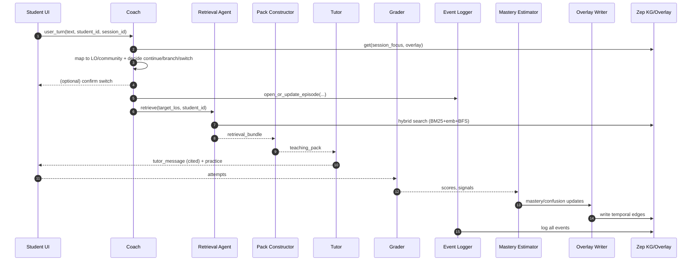
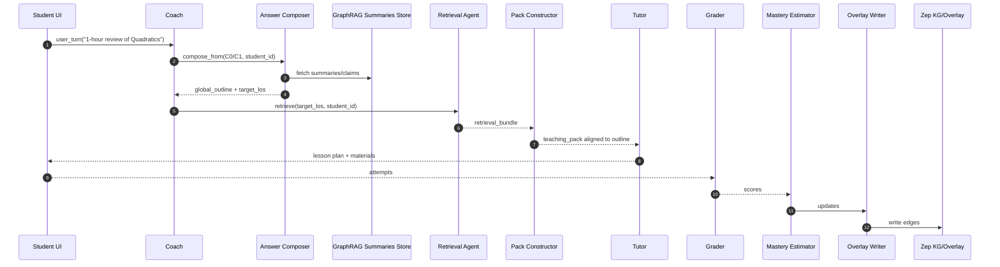
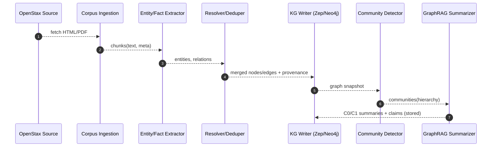

# Sequence Diagrams

## 1) Typical topic-focused turn (runtime)

```mermaid
sequenceDiagram
  autonumber
  participant U as Student UI
  participant C as Coach
  participant RET as Retrieval Agent
  participant PC as Pack Constructor
  participant T as Tutor
  participant G as Grader
  participant EV as Event Logger
  participant ME as Mastery Estimator
  participant OW as Overlay Writer
  participant Z as Zep KG/Overlay

  U->>C: user_turn(text, student_id, session_id)
  C->>Z: get(session_focus, overlay)
  C->>C: map to LO/community + decide continue/branch/switch
  C-->>U: (optional) confirm switch
  C->>EV: open_or_update_episode(...)
  C->>RET: retrieve(target_los, student_id)
  RET->>Z: hybrid search (BM25+emb+BFS)
  RET-->>PC: retrieval_bundle
  PC-->>T: teaching_pack
  T-->>U: tutor_message (cited) + practice
  U-->>G: attempts
  G-->>ME: scores, signals
  ME->>OW: mastery/confusion updates
  OW->>Z: write temporal edges
  EV->>Z: log all events
```

## 2) Broad “unit review” turn (uses GraphRAG summaries)

```mermaid
sequenceDiagram
  autonumber
  participant U as Student UI
  participant C as Coach
  participant AC as Answer Composer
  participant GR as GraphRAG Summaries Store
  participant RET as Retrieval Agent
  participant PC as Pack Constructor
  participant T as Tutor
  participant G as Grader
  participant ME as Mastery Estimator
  participant OW as Overlay Writer
  participant Z as Zep KG/Overlay

  U->>C: user_turn("1-hour review of Quadratics")
  C->>AC: compose_from(C0/C1, student_id)
  AC->>GR: fetch summaries/claims
  AC-->>C: global_outline + target_los
  C->>RET: retrieve(target_los, student_id)
  RET-->>PC: retrieval_bundle
  PC-->>T: teaching_pack aligned to outline
  T-->>U: lesson plan + materials
  U-->>G: attempts
  G-->>ME: scores
  ME->>OW: updates
  OW->>Z: write edges
```

## 3) Offline indexing (build/refresh the static subject map)

```mermaid
sequenceDiagram
  autonumber
  participant SRC as OpenStax Source
  participant ING as Corpus Ingestion
  participant EFX as Entity/Fact Extractor
  participant RES as Resolver/Deduper
  participant KG as KG Writer (Zep/Neo4j)
  participant COM as Community Detector
  participant GRG as GraphRAG Summarizer

  SRC-->>ING: fetch HTML/PDF
  ING-->>EFX: chunks(text, meta)
  EFX-->>RES: entities, relations
  RES-->>KG: merged nodes/edges + provenance
  KG-->>COM: graph snapshot
  COM-->>GRG: communities(hierarchy)
  GRG-->>KG: C0/C1 summaries + claims (stored)
```
