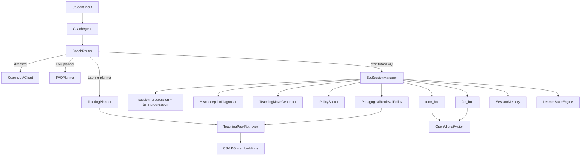
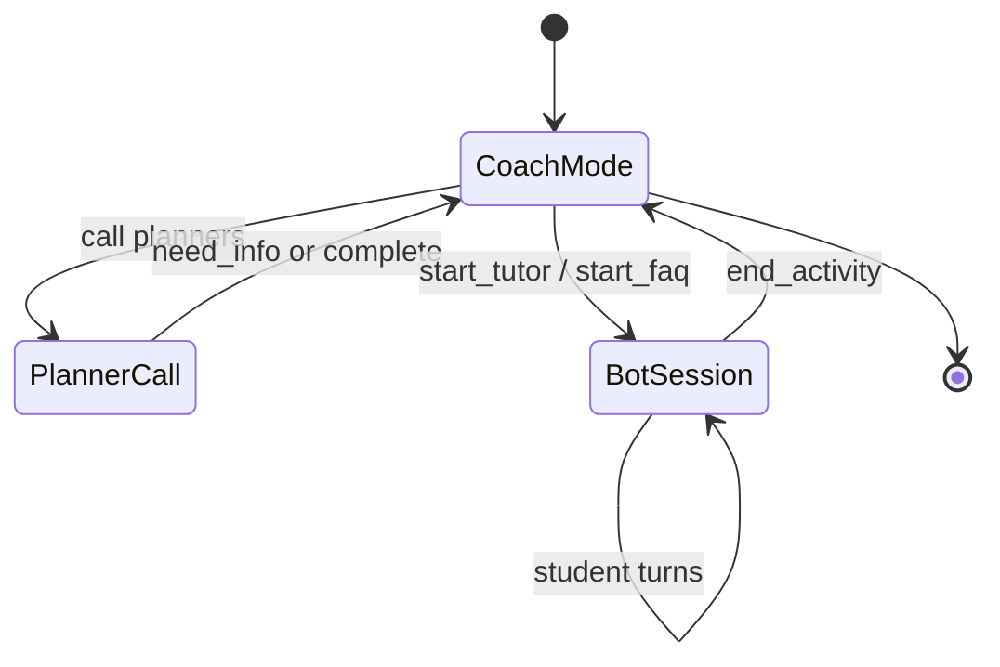

# Adaptive Tutoring System — Implementation Architecture Specification

**Scope:** This document describes the **adaptive tutoring runtime** under [`src/workflow_demo/`](../src/workflow_demo/). The repository root [`README.md`](../README.md) points here as the **canonical** architecture for that runtime. **Offline KG construction** lives under [`src/knowledge_graph_gen/`](../src/knowledge_graph_gen/); retrieval / ingestion design sketches live under [`architecture/`](../architecture/) (for example [`g10_retrieval.md`](../architecture/g10_retrieval.md), [`manual_ingestion.md`](../architecture/manual_ingestion.md)).

**Conventions:** Paths are relative to the repository root unless noted. **Python 3.10+** is recommended for the runtime (3.11+ typical for development). Re-run `pytest tests/workflow_demo` and `python -m src.workflow_demo.pedagogy_eval` after substantive changes; exact pass counts below are **illustrative**, not a contract.

---

## SECTION 1 — Executive system summary

**What the system does:** A **local-first** Python runtime (`CoachAgent`) orchestrates an LLM-driven **coach** that routes students into **tutoring** or **FAQ** bot sessions. Tutoring combines (a) **retrieval over a CSV-backed knowledge graph** in `demo/`, (b) a **session plan** of learning objectives (LOs) from `TutoringPlanner` in `src/workflow_demo/planner.py` via `retrieve_candidates`, and (c) a **pedagogy layer** on each tutor student turn: **misconception diagnosis** → **teaching move candidates** → **deterministic policy scoring** → **pedagogical retrieval policy** that decides reuse vs refresh of a **teaching pack**, then **tutor LLM** JSON responses with optional **math example guard**.

**Major layers:**

1. **Data / KG artifacts** — CSVs (`lo_index`, `content_items`, `edges_prereqs`, `edges_content`) loaded by [`load_demo_frames`](src/workflow_demo/data_loader.py).
2. **Retrieval** — [`TeachingPackRetriever`](src/workflow_demo/retriever.py): hybrid dense + BM25 (RRF), optional LLM rerank, graph expansion into teaching packs; parallel `retrieve_candidates` for planner LO picking.
3. **Orchestration** — [`CoachAgent`](src/workflow_demo/coach_agent.py) + [`CoachRouter`](src/workflow_demo/coach_router.py) + [`CoachLLMClient`](src/workflow_demo/coach_llm_client.py); [`BotSessionManager`](src/workflow_demo/bot_sessions.py) for tutor/FAQ lifecycle.
4. **Pedagogy** — [`MisconceptionDiagnoser`](src/workflow_demo/pedagogy/diagnosis.py), [`TeachingMoveGenerator`](src/workflow_demo/pedagogy/teaching_moves.py), [`PolicyScorer`](src/workflow_demo/pedagogy/policy.py), [`PedagogicalRetrievalPolicy`](src/workflow_demo/pedagogy/retrieval_policy.py), [`compute_turn_progression_signals`](src/workflow_demo/pedagogy/turn_progression.py), [`session_progression`](src/workflow_demo/pedagogy/session_progression.py).
5. **Integration** — [`web_api.py`](src/workflow_demo/web_api.py) FastAPI: REST + SSE; [`runtime_factory.build_coach_runtime`](src/workflow_demo/runtime_factory.py); optional **CLI** [`run_demo.py`](src/workflow_demo/run_demo.py); optional **React + Vite** UI under [`frontend/`](../frontend/).

**Main runtime path (happy path):** Student → coach LLM directive → `call_tutoring_planner` → `TutoringPlanner.create_plan` (`retrieve_candidates` + heuristic or optional planner LLM) → `start_tutor` → `BotSessionManager.begin` → `create_handoff_context` + `ensure_tutor_learner_context` → `tutor_bot` opening message. Subsequent turns: diagnosis + policy + retrieval → `tutor_bot` → optional math guard.

**Design principles visible in code:** (1) **Separation of planner LO selection** (`retrieve_candidates`, simple plan JSON) from **rich pack assembly** (`retrieve_plan`, used in pedagogy refresh paths). (2) **Deterministic policy** with explicit tie-breaks, progression gates, and **session progression** tracking to advance through planned LOs without looping. (3) **Feature flags** for LLM-heavy components (planner LLM, diagnosis LLM, math guard). (4) **JSON-only** tutor/FAQ contracts with retry. (5) **Anti-loop mechanisms** — turn progression signals suppress repeat diagnostics not just after `diagnostic_question` but also after bridge/teach moves (worked_example, graduated_hint, explain_concept) when the learner shows engagement.

**Difference from generic RAG tutor:** Explicit **target_lo vs instruction_lo**, **move-typed conditioning** (`tutor_instruction_directives` — now 7 keys including `plan_complete`), **retrieval policy** with logical actions (`reuse_pack` / `augment_pack` / `refresh_pack`) mapped to **execution modes** (`no_io` / `constrained_refresh` / `full_refresh`), **session progression** (step-by-step advancement through planned LOs with `active_step_focus_state` tracking), **turn progression** to suppress repeated diagnostics across both diagnostic and bridge moves, **plan completion signal** that auto-wraps tutor sessions, and **in-process pedagogy events** for observability.

---

## SECTION 2 — Repository and subsystem map

| Subsystem | Purpose | Key modules | Upstream | Downstream |
|-----------|---------|-------------|----------|------------|
| **Demo KG + loader** | Static curriculum graph | [`data_loader.py`](src/workflow_demo/data_loader.py), [`demo/*.csv`](demo) | CSV files | `TeachingPackRetriever`, planners |
| **Embeddings / retrieval** | Hybrid search, packs, CLIP | [`retriever.py`](src/workflow_demo/retriever.py), [`clip_embeddings.py`](src/workflow_demo/clip_embeddings.py) | OpenAI embeddings API, optional CLIP | Planners, `PedagogicalRetrievalPolicy` |
| **Coach orchestration** | Routing, state | [`coach_agent.py`](src/workflow_demo/coach_agent.py), [`coach_router.py`](src/workflow_demo/coach_router.py), [`coach_llm_client.py`](src/workflow_demo/coach_llm_client.py) | OpenAI | Planners, `BotSessionManager` |
| **Planners** | Tutoring + FAQ plan JSON | [`planner.py`](src/workflow_demo/planner.py) | Retriever, optional planner LLM | Session params in handoff |
| **Bot sessions** | Tutor/FAQ turns, pedagogy pipeline | [`bot_sessions.py`](src/workflow_demo/bot_sessions.py) | Diagnoser, policy, retrieval | `tutor_bot` / `faq_bot` |
| **Pedagogy core** | Diagnosis, moves, policy, retrieval, session progression | [`pedagogy/`](src/workflow_demo/pedagogy/) | Learner state, retriever | `pedagogy_context`, events |
| **Tutor / FAQ LLM** | Student-facing JSON bots | [`tutor.py`](src/workflow_demo/tutor.py) | Handoff payload | Student message |
| **Session + profile** | History, `lo_mastery` | [`session_memory.py`](src/workflow_demo/session_memory.py), [`demo_profiles.py`](src/workflow_demo/demo_profiles.py) | Disk (optional) | Coach, mastery updates |
| **Learner state (pedagogy)** | In-session attempts, misconceptions | [`learner_state.py`](src/workflow_demo/pedagogy/learner_state.py), [`state_store.py`](src/workflow_demo/pedagogy/state_store.py) | Profile seed | Policy, snapshot |
| **Runtime events** | Structured telemetry | [`runtime_events.py`](src/workflow_demo/runtime_events.py), [`pedagogy/events.py`](src/workflow_demo/pedagogy/events.py) | Coach emit | Web sink, logs |
| **Web API** | HTTP bridge | [`web_api.py`](src/workflow_demo/web_api.py) | FastAPI | Coach |
| **Eval harness** | Scenario pedagogy checks | [`pedagogy_eval/harness.py`](src/workflow_demo/pedagogy_eval/harness.py) | Mocks/patches | Reports |
| **Offline experiments** | LLM edge discovery | [`src/knowledge_graph_gen/`](../src/knowledge_graph_gen) (`run.py`, `prepare_nodes.py`, `discover_*`, `evaluate_*`) | OpenAI | Versioned CSVs under `knowledge_graph/runs/` (promote to `demo/` manually) |
| **CLI demo** | REPL coach/tutor | [`run_demo.py`](src/workflow_demo/run_demo.py) | Same runtime as API | Terminal |
| **Multimodal input** | Image paths / URLs in user text | [`image_preprocessor.py`](src/workflow_demo/image_preprocessor.py), `CoachAgent.process_multimodal_turn` | OpenAI (optional) | Tutor vision + CLIP retrieval |
| **Frontend** | Browser chat against API | [`frontend/`](../frontend/) | FastAPI backend | Student UI |

**`pedagogy/` package (file index):** [`__init__.py`](src/workflow_demo/pedagogy/__init__.py) (public exports), [`constants.py`](src/workflow_demo/pedagogy/constants.py), [`models.py`](src/workflow_demo/pedagogy/models.py), [`diagnosis.py`](src/workflow_demo/pedagogy/diagnosis.py), [`diagnosis_rules.py`](src/workflow_demo/pedagogy/diagnosis_rules.py), [`diagnosis_llm.py`](src/workflow_demo/pedagogy/diagnosis_llm.py), [`diagnosis_config.py`](src/workflow_demo/pedagogy/diagnosis_config.py) (e.g. `HEURISTIC_ACCEPT_CONFIDENCE`, `WORKFLOW_DEMO_ENABLE_DIAGNOSIS_LLM`), [`teaching_moves.py`](src/workflow_demo/pedagogy/teaching_moves.py), [`policy.py`](src/workflow_demo/pedagogy/policy.py), [`retrieval_policy.py`](src/workflow_demo/pedagogy/retrieval_policy.py), [`instruction_lo.py`](src/workflow_demo/pedagogy/instruction_lo.py), [`learner_state.py`](src/workflow_demo/pedagogy/learner_state.py), [`state_store.py`](src/workflow_demo/pedagogy/state_store.py), [`session_progression.py`](src/workflow_demo/pedagogy/session_progression.py), [`turn_progression.py`](src/workflow_demo/pedagogy/turn_progression.py), [`math_example_guard.py`](src/workflow_demo/pedagogy/math_example_guard.py), [`events.py`](src/workflow_demo/pedagogy/events.py), [`tutor_pedagogy_snapshot.py`](src/workflow_demo/pedagogy/tutor_pedagogy_snapshot.py).

**Navigation tip:** Start at [`runtime_factory.py`](src/workflow_demo/runtime_factory.py) → [`coach_agent.py`](src/workflow_demo/coach_agent.py) → [`bot_sessions.py`](src/workflow_demo/bot_sessions.py) → [`retriever.py`](src/workflow_demo/retriever.py) + [`pedagogy/retrieval_policy.py`](src/workflow_demo/pedagogy/retrieval_policy.py).

---

## SECTION 3 — Data ingestion and knowledge graph pipeline

**Source data types (runtime demo):** Four CSVs under [`demo/`](demo): `lo_index.csv`, `content_items.csv`, `edges_prereqs.csv`, `edges_content.csv` (see [`load_demo_frames`](src/workflow_demo/data_loader.py)).

**Schema (as used by loader):**

- **LOs:** DataFrame `los` + `lo_lookup: dict[lo_id → row dict]` including fields consumed by retrieval such as `learning_objective`, book/unit/chapter, pedagogical hints via `_get_how_to_teach` / `_get_why_to_teach` in retriever (from LO rows).
- **Content:** `content` DataFrame; items joined to LOs for snippets and `content_type`.
- **Prerequisites:** `edges_prereqs` → `prereq_in_map` (adjacency for prerequisite expansion).
- **Content–LO links:** `edges_content` → `content_ids_map`.

**How content becomes structured:** The **online** tutor does not run ingestion; it reads **pre-built** CSVs under `demo/`. **Offline** construction is documented in [`src/knowledge_graph_gen/README.md`](../src/knowledge_graph_gen/README.md) and implemented under [`src/knowledge_graph_gen/`](../src/knowledge_graph_gen). Outputs land in `knowledge_graph/runs/`.

**Validation:** [`load_demo_frames`](src/workflow_demo/data_loader.py) builds maps; structural validation for manual experiments is **not centralized** in `workflow_demo` (experiments scripts bear their own checks).

**Storage format:** Pandas in memory; optional **embedding cache** under `demo/.embedding_cache/` (`.npy` files, hash-keyed) in [`TeachingPackRetriever`](src/workflow_demo/retriever.py).

**Ambiguities:** Notes under `architecture/` may describe **ideal** or pipeline-specific schemas; the **running tutor** uses the **demo CSV layout** consumed by `load_demo_frames`.

---

## SECTION 4 — Retrieval / RAG architecture

### 4.1 Components

- **Dense embeddings:** OpenAI `text-embedding-3-large` or `-small` via [`EmbeddingBackend`](src/workflow_demo/retriever.py) (requires `OPENAI_API_KEY`).
- **Lexical:** BM25 via `rank_bm25` when installed; if import fails, hybrid degrades to semantic-only (logged).
- **Fusion:** [`_hybrid_fusion`](src/workflow_demo/retriever.py) — **RRF** over semantic + BM25 hit lists (separate pipelines for LO vs content indices).
- **Reranking:** Optional OpenAI chat completion (`rerank_model`, default `gpt-5.4-mini` in retriever `__init__`) in `_rerank_hits`; **disabled** in pedagogical `retrieve_plan` calls from [`PedagogicalRetrievalPolicy.run`](src/workflow_demo/pedagogy/retrieval_policy.py) (`enable_rerank=False`).
- **Graph-aware behavior:** [`_build_teaching_pack`](src/workflow_demo/retriever.py) pulls prerequisite rows from `kg.prereq_in_map`; content rows typed as `concept` / `example` / `try_it` / etc. feed **examples** vs **practice** slots; **images** from `_search_images` when metadata exists.

### 4.2 Two retrieval entry points

| Method | Used by | Output role |
|--------|---------|-------------|
| `retrieve_candidates` | `TutoringPlanner` | `RetrievalCandidate` list → **coach plan** (LO titles, how/why, book metadata) |
| `retrieve_plan` | `PedagogicalRetrievalPolicy` (augment/refresh), image preprocessor | [`SessionPlan`](src/workflow_demo/models.py) with `TeachingPack` + internal `PlanStep` lists |

**Important inconsistency:** The **tutor handoff `current_plan`** comes from the **planner** (list of LO dicts: `lo_id`, `title`, `proficiency`, `how_to_teach`, `why_to_teach`, `notes`, `is_primary`). The `retrieve_plan` path builds a **different** `current_plan` as `List[PlanStep]` inside `SessionPlan` — that structure is **not** what the coach passes to the tutor in the main flow; it is used when assembling **teaching_pack** inside retrieval policy refresh.

### 4.3 Teaching pack construction

[`_build_teaching_pack`](src/workflow_demo/retriever.py) builds:

- `key_points` (synthetic strings + related LOs),
- `examples` / `practice` from content hits by `content_type`,
- `prerequisites` from graph prereq IDs,
- `citations`, `images` (image search).

### 4.4 `retrieval_intent` vs `retrieval_action` vs `retrieval_execution_mode`

- **`PedagogicalRetrievalIntent`** ([`constants.py`](src/workflow_demo/pedagogy/constants.py)): Step-1 **pedagogical** intent — `teach_current_concept`, `repair_prerequisite`, `retrieve_worked_example`, `retrieve_misconception_support`. Set by [`decide_pedagogical_retrieval_intent`](src/workflow_demo/pedagogy/retrieval_policy.py) from **move type + diagnosis**.
- **`RetrievalPolicyAction`** (stored on context as string **`retrieval_action`**): Logical decision — `reuse_pack`, `augment_pack`, `refresh_pack`. From [`decide_retrieval_action`](src/workflow_demo/pedagogy/retrieval_policy.py) using **material triggers** `t1`–`t5` (session target change, instruction unsupported by pack, missing artifact for intent, diagnosis fingerprint change, empty/invalid pack). Trigger `t4` now uses [`diagnosis_fingerprint_coarse`](src/workflow_demo/pedagogy/retrieval_policy.py) (target + prereqs only, omitting suspected_misconception label) to reduce pack churn from label jitter while still detecting real diagnostic shifts.
- **`RetrievalExecutionMode`:** **Physical** mapping ([`map_action_to_execution_mode`](src/workflow_demo/pedagogy/retrieval_policy.py)):
  - `reuse_pack` → `no_io`
  - `augment_pack` → `constrained_refresh` (**implemented as full `retrieve_plan`**, not incremental merge — comment in code: v1 prefers `retrieve_plan` over weak merge)
  - `refresh_pack` → `full_refresh`
- **`legacy_retrieval_intent`:** From move’s [`RetrievalIntent`](src/workflow_demo/pedagogy/constants.py) enum via `_map_move_to_intent`; carried in policy output but tutor payload emphasizes `PedagogicalRetrievalIntent` strings on `pedagogy_context`.

**Approximation:** “Augment” does not merge retrieved rows into the old pack in the success path; it **replaces** with a fresh `retrieve_plan` teaching pack (constrained `top_k` in augment path).

**Pack coverage check:** [`_pack_covers_instruction_lo`](src/workflow_demo/pedagogy/retrieval_policy.py) now scans `key_points`, `examples`, `practice`, `prerequisites`, and `citations` (previously only key_points and examples), reducing false-positive `t2` triggers when instruction content exists in other pack sections.

### 4.5 Candidate retrieval vs plan retrieval

- **Planner:** Only needs ranked LOs → `retrieve_candidates` (text + optional CLIP image path).
- **Pedagogy refresh:** Needs full pack → `retrieve_plan` with query composed from student text, LO strings, and session params.

### 4.6 Errors / gaps

- If `retrieve_plan` raises, policy returns **`fallback_used=True`**, keeps prior pack when possible, appends error strings ([`PedagogicalRetrievalOutput.errors`](src/workflow_demo/pedagogy/retrieval_policy.py)).
- **Opening tutor message:** `retrieve_plan` is **not** called in `TutoringPlanner` or `begin()`; **`teaching_pack` may be absent or empty** until the first **student** turn runs pedagogy (triggers `t5` → refresh). *Implemented gap worth flagging for product accuracy.*

---

## SECTION 5 — Planning and agent orchestration

### 5.1 Roles

- **Coach (`CoachLLMClient`):** JSON directive: `action` ∈ `none | call_tutoring_planner | call_faq_planner | start_tutor | start_faq | show_proficiency` ([`COACH_SYSTEM_PROMPT`](src/workflow_demo/coach_llm_client.py)).
- **Tutoring planner (`TutoringPlanner`):** `create_plan` → `{ status, plan, message }`; uses `retrieve_candidates` + proficiency map + optional LLM (`WORKFLOW_DEMO_ENABLE_PLANNER_LLM`) or **heuristic** plan ([`_build_heuristic_plan`](src/workflow_demo/planner.py)).
- **FAQ planner (`FAQPlanner`):** Maps to canned `FAQ_TOPICS` strings or LLM-assisted topic pick when enabled.
- **Tutor bot (`tutor_bot`):** JSON tutor responses from [`TUTOR_SYSTEM_PROMPT`](src/workflow_demo/tutor.py).
- **FAQ bot (`faq_bot`):** JSON from [`FAQ_SYSTEM_PROMPT`](src/workflow_demo/tutor.py).
- **Session manager (`BotSessionManager`):** Owns handoff, conversation history, pedagogy pipeline on tutor turns.

### 5.2 Routing

[`CoachRouter.handle_turn`](src/workflow_demo/coach_router.py): pre-classification (FAQ keywords, session history regex, syllabus escalation, fast-track topic after clarification) → loop (max 5) calling `_get_directive` → planner or `begin()`.

**Plan conflict:** [`_detect_plan_conflicts`](src/workflow_demo/coach_router.py) only on `REPLANNABLE_KEYS` = `{mode, topic}` — **subject** excluded by comment.

### 5.3 Session start and handoff

[`create_handoff_context`](src/workflow_demo/session_memory.py): `handoff_metadata`, `session_params`, `conversation_summary`, `recent_sessions`, `student_state`, `image`.

Tutor: [`ensure_tutor_learner_context`](src/workflow_demo/coach_agent.py) seeds `pedagogy_context` as JSON from [`PedagogicalContext`](src/workflow_demo/pedagogy/models.py) (learner state, `target_lo`, `instruction_lo`, `retrieval_session` snapshot). It also calls [`build_initial_session_progression`](src/workflow_demo/pedagogy/session_progression.py) to initialize `extensions.progression` with a step list derived from `current_plan` (order preserved, titles de-duplicated, `is_primary` tagged as `"primary"` vs `"support"`).

---

## SECTION 6 — Pedagogy architecture

### 6.1 Learner state engine ([`LearnerStateEngine`](src/workflow_demo/pedagogy/learner_state.py))

- **Purpose:** Session-local state: attempts, misconception history, hints; snapshot for API.
- **Inputs:** `student_profile` seed (`lo_mastery`, `confidence_seed`), per-turn updates.
- **Outputs:** `LearnerState` model; events `pedagogy_learner_state_initialized` / `_updated`.
- **Storage:** [`LearnerStateStore`](src/workflow_demo/pedagogy/state_store.py) — **in-memory only** (not persisted across process restart).
- **Limitation:** Explicitly **no BKT** (see docstring).

### 6.2 Misconception diagnosis ([`MisconceptionDiagnoser`](src/workflow_demo/pedagogy/diagnosis.py))

- **Heuristic first** ([`HeuristicDiagnoser`](src/workflow_demo/pedagogy/diagnosis_rules.py)); if confidence ≥ `HEURISTIC_ACCEPT_CONFIDENCE` (0.55), return.
- Else **optional LLM** ([`LLMDiagnosisAdapter`](src/workflow_demo/pedagogy/diagnosis_llm.py)) if `WORKFLOW_DEMO_ENABLE_DIAGNOSIS_LLM` set.
- Else return heuristic (possibly low confidence).

**`MisconceptionDiagnosis` fields:** `target_lo`, `suspected_misconception`, `confidence`, `rationale`, `prerequisite_gap_los`, `evidence_quotes` ([`models.py`](src/workflow_demo/pedagogy/models.py)).

### 6.3 Teaching move generation ([`TeachingMoveGenerator`](src/workflow_demo/pedagogy/teaching_moves.py))

- Produces **2–4** candidates among: `diagnostic_question`, `prereq_remediation`, `graduated_hint`, `worked_example` (plus filler from fallback order).
- **Note:** Enum includes `explain_concept` but **generator does not emit it** in `generate_candidates` — tutor prompt still lists “other” move types; **policy may never select `explain_concept` from this generator**.

### 6.4 Policy scorer ([`PolicyScorer`](src/workflow_demo/pedagogy/policy.py))

- Scores each candidate with weighted features (expected gain, priority, leakage risk) + situation flags (low confidence, prereq gap, stuck, etc.).
- **Turn progression penalties/boosts:** `suppress_repeat_diagnostic` applies **penalty** `_REPEAT_DIAGNOSTIC_SCORE_PENALTY` (2.5) to `diagnostic_question`; explicit advance intent without suppress gate applies `_EXPLICIT_ADVANCE_DIAGNOSTIC_NUDGE` (0.35); example-request boosts `worked_example` (+1.45) and penalizes `diagnostic_question` (−0.95), with `graduated_hint` fallback (+1.25) when no worked_example candidate exists.
- **Session progression inputs:** `select_best_move` now accepts `progression_just_advanced`, `progression_step_passed`, and `step_focus_state` parameters:
  - When step index advanced or final step passed: strong diagnostic penalty (`_PROGRESSION_STRONG_DIAGNOSTIC_PENALTY` = 2.0) + concrete move boosts (`_PROGRESSION_CONCRETE_MOVE_BOOST` = 0.55 for worked_example, ×0.7 for graduated_hint).
  - Same-step substantive engagement (substantive answer or example request, no confusion/short ack): diagnostic penalty (1.2), concrete boosts (0.35).
  - Explicit advance (non-confused, non-short): diagnostic penalty (1.5), concrete boosts (0.45).
  - Adequate understanding (non-confused, non-short): strong diagnostic penalty (3.0), concrete boost (0.5).
  - **Step focus state** `"covered"` or `"satisfied"`: diagnostic penalty (2.2), concrete boosts (0.4) — avoids re-checking an LO subidea already engaged with.
- **Output:** [`PolicyDecision`](src/workflow_demo/pedagogy/models.py) with `selected_move`, `scores`, `decision_reason`.

### 6.5 `target_lo` vs `instruction_lo`

- **`session_target_lo` / `target_lo`:** Stable session goal — from prior `pedagogy_context.target_lo` or plan focus ([`bot_sessions._run_misconception_diagnosis`](src/workflow_demo/bot_sessions.py)).
- **`instruction_lo`:** Per-turn focus from [`derive_instruction_lo`](src/workflow_demo/pedagogy/instruction_lo.py) with the following precedence (**first match wins** in code):
  1. **`selected_move_type == PREREQ_REMEDIATION`** and non-empty `diagnosis.prerequisite_gap_los` → first gap entry (string).
  2. **`active_progression_lo`** from session progression (when steps exist and value is not an unknown sentinel) — keeps the instructional focus aligned with the **current plan step**.
  3. Concrete `diagnosis.target_lo` (not `unknown`) → that value.
  4. `session_target_lo` fallback (or `"unknown"`).

**Policy coupling (important):** Branch (1) applies only when the **`PolicyScorer` selected move** is `prereq_remediation`. A diagnosis may still list **`prerequisite_gap_los`** while the policy selects another move (for example `diagnostic_question`); in that case **`instruction_lo` follows branch (2) or (3)**—often the **progression LO** (e.g. primary plan title) rather than the first gap string. Product behavior “always teach the gap first” therefore requires both **diagnosis** and **policy** alignment, not the diagnosis alone.

### 6.6 Retrieval policy (see Section 4)

Triggers `t1`–`t5`; fingerprint via [`diagnosis_fingerprint`](src/workflow_demo/pedagogy/retrieval_policy.py).

### 6.7 Tutor conditioning

[`tutor_instruction_directives`](src/workflow_demo/tutor.py) — **seven keys**: `session_target_lo`, `instruction_lo`, `selected_move_type`, `retrieval_intent`, `retrieval_action`, `policy_reason`, **`plan_complete`**. Dual-written as `tutor_directives` on `pedagogy_context`. **`retrieval_execution_mode` is NOT in directives** (tutor system prompt: execution mode on `pedagogy_context` only).

**`plan_complete` flag:** Set `True` when `current_step_passed` is true and `active_step_index >= len(steps) - 1` (i.e. the final progression step has been passed). The tutor system prompt instructs: when `plan_complete` is true, give a brief 2–3 sentence recap, mention what the learner could explore next (from `future_plan` if available), and set `end_activity=true`.

### 6.8 Turn progression / repeated-check suppression

[`compute_turn_progression_signals`](src/workflow_demo/pedagogy/turn_progression.py) computes a `TurnProgressionSignals` dataclass with seven boolean flags: `explicit_advance_intent`, `adequate_check_response`, `current_confusion_signal`, `short_low_signal_ack`, `learner_requested_example`, `substantive_answer_attempt`, `suppress_repeat_diagnostic`.

**`suppress_repeat_diagnostic`** fires in two cases:
1. **After `diagnostic_question`:** when student reply is not confused and not a pure short ack (any engaged reply ends the immediate re-check).
2. **After bridge/teach moves** (`worked_example`, `graduated_hint`, `explain_concept`): when the learner shows engagement — explicit advance, adequate response, substantive answer attempt, example request, or a non-trivial message (≥12 chars) — and not confused or short ack. This prevents the tutor from snapping back to another broad check on the same LO subidea after a bridge turn.

**`adequate_check_response`:** Heuristic requiring non-short-ack, non-confused text with either understanding-confidence phrases (e.g. "I understand", "this makes sense", "it clicks now") or sufficient length (≥40 chars) plus substance tokens (math/domain cues).

**`substantive_answer_attempt`:** Context-dependent: after `diagnostic_question`, requires concrete math attempt; after `worked_example`/`graduated_hint`/`explain_concept`, also accepts substance tokens or non-trivial text (≥12 chars).

**Short-ack exclusions:** Short math replies (containing `=`, expression tokens, or numeric-answer phrasing) and understanding-confidence phrases are not treated as low-signal acks, even if below `LOW_SIGNAL_MIN_CHARS`.

### 6.9 Session progression ([`session_progression.py`](src/workflow_demo/pedagogy/session_progression.py))

Session-local tracking that advances the learner through planned LOs without looping. Stored under `pedagogy_context["extensions"]["progression"]`.

**Initialization:** [`build_initial_session_progression`](src/workflow_demo/pedagogy/session_progression.py) builds a step list from `current_plan` (order preserved, titles de-duplicated, each tagged `"primary"` or `"support"` from `is_primary`). Falls back to `learning_objective` / `title` as a single `"fallback"` step if plan is empty. Initial state: `active_step_index=0`, `current_step_passed=False`, `active_step_focus_state="fresh"`.

**Step advancement:** [`apply_session_progression_update`](src/workflow_demo/pedagogy/session_progression.py) advances based on `TurnProgressionSignals`:
- `adequate_check_response` → always advances.
- `explicit_advance_intent` → advances for primary steps; blocked for `"support"` steps unless `adequate_check_response` also fires.
- Blocked when `current_confusion_signal` or `short_low_signal_ack`.
- `substantive_answer_attempt` and `learner_requested_example` do **not** advance the index (engagement without demonstrated understanding).
- If more steps remain: increments index, resets `current_step_passed`. If at the last step: sets `current_step_passed=True` (triggers `plan_complete`).

**Focus state:** [`update_same_step_focus_state`](src/workflow_demo/pedagogy/session_progression.py) tracks `"fresh"` → `"covered"` → `"satisfied"` per step:
- Resets to `"fresh"` when step index changes.
- `adequate_check_response` or `explicit_advance_intent` → `"satisfied"`.
- `suppress_repeat_diagnostic` (without adequate/advance) when `"fresh"` → `"covered"`.
- Policy uses focus state to apply `_STEP_FOCUS_DIAGNOSTIC_PENALTY` (2.2) on `"covered"` or `"satisfied"` steps.

**Diagnoser focus:** When progression steps exist, the diagnoser receives `active_progression_lo` (from current step) rather than the prior instruction LO, keeping diagnosis anchored to the current plan step.

### 6.10 Math guard

[`maybe_apply_math_example_guard`](src/workflow_demo/pedagogy/math_example_guard.py): only if `WORKFLOW_DEMO_TUTOR_MATH_GUARD` and `selected_move_type == worked_example`; sympy verifies **single** integral or derivative **polynomial** pattern; repair or append note.

### 6.11 Observability

[`PedagogyRuntimeEvent`](src/workflow_demo/pedagogy/events.py) emitted from [`bot_sessions._run_misconception_diagnosis`](src/workflow_demo/bot_sessions.py) (diagnosis, moves, policy, retrieval decided/executed) and math guard callbacks.

---

## SECTION 7 — Student profile and learner-state lifecycle

**Student profile (`SessionMemory.student_profile`):** Default `{"lo_mastery": {}}`. Seeded in [`build_coach_runtime`](src/workflow_demo/runtime_factory.py) from [`get_active_profile()`](src/workflow_demo/demo_profiles.py) (`ACTIVE_PROFILE` 1=strong, 2=weak — **hardcoded** demo switch).

**Learner state vs profile:** Profile is **durable** (when `session_memory_path` set) for `lo_mastery`; [`LearnerState`](src/workflow_demo/pedagogy/models.py) is **session-scoped in-memory** via `LearnerStateStore`.

**Initialization:** [`initialize_from_profile`](src/workflow_demo/pedagogy/learner_state.py) merges `lo_mastery` into `mastery` map; optional `confidence_seed`.

**Updates:** [`record_turn`](src/workflow_demo/pedagogy/learner_state.py) on student messages (non-debug); [`record_misconception`](src/workflow_demo/pedagogy/learner_state.py) after diagnosis.

**Mastery persistence:** On tutor session end, [`_update_lo_mastery`](src/workflow_demo/bot_sessions.py) maps `session_summary.student_understanding` via [`UNDERSTANDING_TO_MASTERY`](src/workflow_demo/bot_sessions.py) onto `student_profile["lo_mastery"][lo_key]`.

**Aspirational:** Long-term personalization beyond `lo_mastery` dict is **not** implemented.

---

## SECTION 8 — Prompting and runtime payload contracts

### 8.1 Coach

[`COACH_SYSTEM_PROMPT`](src/workflow_demo/coach_llm_client.py): strict JSON with `message_to_student`, `action`, `tool_params` (subject, learning_objective, mode, topic, student_request), `conversation_summary`. **Not** `json_object` response_format in code (plain chat).

### 8.2 Tutoring planner LLM

[`TUTORING_PLANNER_PROMPT`](src/workflow_demo/planner.py): JSON `status` + `plan` with `current_plan` / `future_plan` LO objects — **only when** `WORKFLOW_DEMO_ENABLE_PLANNER_LLM` enabled.

### 8.3 Tutor

- **System:** [`TUTOR_SYSTEM_PROMPT`](src/workflow_demo/tutor.py): rules for plan adherence, off-topic detection, move types, JSON schema.
- **User payload:** JSON with:
  - `handoff_context` (includes `session_params` with `current_plan`, `future_plan`, `mode`, `teaching_pack`, …),
  - `tutor_instruction_directives` (seven fields — see Section 6.7),
  - `tutor_directives` (duplicate),
  - `conversation_history` (last 12),
  - `retrieved_images`.
- **API:** `chat.completions.create` with `response_format={"type":"json_object"}`, temperature 0, up to 2 attempts with [`_JSON_ONLY_RETRY_PROMPT`](src/workflow_demo/tutor.py).

**Authoritative fields:** Move-specific behavior: **`tutor_instruction_directives`** override “Teaching Flow” when non-empty (per prompt). **`teaching_pack`** is grounding source when present.

**Output schema (normalized):** [`_normalize_tutor_response`](src/workflow_demo/tutor.py): `message_to_student`, `end_activity`, `silent_end`, `needs_mode_confirmation`, `needs_topic_confirmation`, `requested_mode`, `session_summary` with topics_covered, student_understanding, etc.

### 8.4 FAQ

[`FAQ_SYSTEM_PROMPT`](src/workflow_demo/tutor.py) + payload `handoff_context` + `conversation_history`; same JSON retry pattern.

### 8.5 Malformed output

Returns [`_fallback_tutor_response`](src/workflow_demo/tutor.py) / `_fallback_faq_response` — **does not** end session (`end_activity=False`).

---

## SECTION 9 — Runtime events, snapshots, debug, backend integration

**Runtime events:** [`emit_runtime_event`](src/workflow_demo/runtime_events.py) → dict with `id`, `type`, `phase`, `message`, `created_at`, `metadata`.

**Web API** ([`web_api.py`](src/workflow_demo/web_api.py)):

| Endpoint | Role |
|----------|------|
| `GET /api/health` | Liveness: `{ "status": "ok" }` |
| `POST /api/session` | Create `WebCoachSession`, run `initial_greeting`, register session |
| `POST /api/chat` | One synchronous turn (`process_turn` in a thread pool) |
| `POST /api/chat/stream` | SSE: `event` frames per runtime event, then `done` or `error` |
| `POST /api/reset` | Rebuild coach + sink for the session id |

**Response bodies (Pydantic models):** In addition to turn text and `events`, API responses include:

- **`pedagogy_snapshot`:** From `CoachAgent.get_pedagogy_snapshot_for_api()` — compact tutor pedagogy state when applicable (else `null`). Built by [`build_tutor_pedagogy_snapshot`](src/workflow_demo/pedagogy/tutor_pedagogy_snapshot.py); may include **`session_progression`** (`active_step_index`, `current_step_passed`, `step_count`, `active_step_lo`, etc.) when progression steps exist.
- **`tutor_session_active`:** From `CoachAgent.tutor_session_active_for_api()` — `true` only when a **tutor** bot session is active (`bot_type == "tutor"`), not during FAQ-only sessions.

These fields appear on **`SessionResponse`** (create session), **`ChatResponse`** (chat), and **`ResetResponse`** (reset) where defined in code.

**SSE stream (`POST /api/chat/stream`):** During the turn, each runtime event is sent as `data: {"kind":"event","event":...}`. The stream ends with either `{"kind":"error","message":...}` or `{"kind":"done","response":...,"pedagogy_snapshot":...,"tutor_session_active":...}`.

**Threading:** One lock per `WebCoachSession` serializes coach access; async handlers offload blocking work to a [`ThreadPoolExecutor`](src/workflow_demo/web_api.py) or a worker thread for streaming.

**Debug commands (tutor-only, no LLM):** `!retrieval`, `!policy`, `!diagnosis`, `!state` in [`bot_sessions.py`](src/workflow_demo/bot_sessions.py) — formatted from the same snapshot builder as the API.

**Env:** `WORKFLOW_DEMO_API_HOST`, `WORKFLOW_DEMO_API_PORT`, `WORKFLOW_DEMO_CORS_ORIGINS`; `.env` loaded from repo root in `web_api` when `python-dotenv` is available.

---

## SECTION 10 — Response generation, post-processing, guardrails

1. **Tutor LLM** produces JSON → `coerce_json` → normalize.
2. **Math guard** (optional env): may mutate `message_to_student`; sets `pedagogy_context.last_guard_result`.
3. **No separate “critic”** in production path (`CriticVerdict` exists in models but not wired in `bot_sessions`).

**FAQ isolation:** FAQ path does not run pedagogy pipeline — only `faq_bot`.

---

## SECTION 11 — Evaluation and testing architecture

**Unit / integration tests** under [`tests/workflow_demo/`](../tests/workflow_demo). Current modules include: `test_acceptance_phase9.py`, `test_coach.py`, `test_e2e.py`, `test_image_preprocessor.py`, `test_instruction_lo.py`, `test_integration.py`, `test_learner_state_engine.py`, `test_math_example_guard.py`, `test_math_guard_integration.py`, `test_misconception_diagnoser.py`, `test_models.py`, `test_pedagogy_eval_harness.py`, `test_pedagogy_models.py`, `test_pedagogy_retrieval_phase5.py`, `test_planner.py`, `test_policy_scorer.py`, `test_retriever.py`, `test_session_memory.py`, `test_session_progression.py`, `test_teaching_move_generator.py`, `test_tutor.py`, `test_tutor_instruction_directives.py`, `test_tutor_pedagogy_snapshot.py`, `test_turn_progression.py`.

**Pedagogy eval harness:** [`python -m src.workflow_demo.pedagogy_eval`](../src/workflow_demo/pedagogy_eval) ([`harness.py`](../src/workflow_demo/pedagogy_eval/harness.py)) runs scripted scenarios with patched `tutor_bot` / diagnosis where needed. With default options, expect **seven** scenarios: **six passed**, **one skipped** when `WORKFLOW_DEMO_TUTOR_MATH_GUARD` is off (math-guard scenario). Enable the guard for full coverage: `WORKFLOW_DEMO_TUTOR_MATH_GUARD=1 python -m src.workflow_demo.pedagogy_eval`.

**CI / local runs:** Execute `pytest tests/workflow_demo` after changes; total test count grows with the suite—**do not treat a fixed number in this doc as authoritative.** Use **Python 3.10+**; Pydantic v2 models in `pedagogy/models.py` assume a modern interpreter.

---

## SECTION 12 — Deployment, configuration, environment assumptions

**Environment variables (non-exhaustive):**

- `OPENAI_API_KEY` — required for embeddings, coach, tutor, optional rerank.
- `WORKFLOW_DEMO_LLM_MODEL` — defaults `gpt-5.4-mini` in coach/tutor init paths.
- `WORKFLOW_DEMO_ENABLE_PLANNER_LLM`, `WORKFLOW_DEMO_ENABLE_DIAGNOSIS_LLM`
- `WORKFLOW_DEMO_TUTOR_MATH_GUARD`
- `WORKFLOW_DEMO_API_HOST`, `WORKFLOW_DEMO_API_PORT`, `WORKFLOW_DEMO_CORS_ORIGINS`

**Python deps:** [`requirements.txt`](../requirements.txt) — openai, pandas, numpy, pydantic, rank-bm25, fastapi, uvicorn, sympy, pytest, etc.

**Artifacts:** [`demo/`](../demo) CSVs + optional `.embedding_cache/`; optional CLIP `image_corpus` under workflow_demo per retriever.

**Startup:** `python -m src.workflow_demo.web_api` (see [`web_api.py`](../src/workflow_demo/web_api.py) `main()`).

---

## SECTION 13 — Known limitations, ambiguities, open questions

**Implemented:** Coach/planner/tutor loop; pedagogy on tutor **student** turns; retrieval policy; progression gates; math guard (narrow); FastAPI bridge; session progression with plan completion signal; anti-loop mechanisms for bridge/teach moves.

**Partial / gaps:**

- Initial tutor opening may lack **`teaching_pack`** until first student turn.
- **`augment_pack`** ≈ full `retrieve_plan` replace, not true additive merge (except failed fallback path).
- **Docs vs repo:** offline generation lives under [`src/knowledge_graph_gen/`](../src/knowledge_graph_gen); see that folder’s README.
- **TeachingMoveGenerator** emits only `diagnostic_question`, `prereq_remediation`, `graduated_hint`, `worked_example`; enum **`explain_concept`** exists but is not produced by the generator (tutor prompt may still mention it—see Section 6.3).
- **Learner state** not persisted to disk (unlike optional session memory).
- **Session progression** is MVP — step advancement is heuristic (phrase matching), not grading-based. `"support"` steps require `adequate_check_response` before advancing (explicit advance alone is blocked), which may feel conservative for some learners.
- **`instruction_lo` vs diagnosis gaps:** If acceptance or integration tests assume “first gap string becomes `instruction_lo`” whenever `prerequisite_gap_los` is non-empty, they must align with **policy’s selected move** (`PREREQ_REMEDIATION` required for gap-first mapping in `derive_instruction_lo`)—see Section 6.5.

**Resolved (since prior spec revision):**

- **Retrieval policy `NameError`** on `diagnosis_fingerprint` — fixed; coarse fingerprint variant added for trigger `t4`.
- **Diagnostic loop after bridge moves** — `suppress_repeat_diagnostic` now fires after `worked_example`/`graduated_hint`/`explain_concept` when the learner shows engagement.
- **Pack coverage false positives** — `_pack_covers_instruction_lo` now checks `practice`, `prerequisites`, and `citations` in addition to `key_points` and `examples`.
- **Plan completion signal** — `plan_complete` flag threaded through tutor directives so sessions wrap up automatically when all LOs are covered.

**Model-quality dependence:** Coach directives, tutor wording, optional planner/diagnosis LLMs.

**Open questions (needs product/architect confirmation):**

1. Intended long-term relationship between **planner `current_plan` LO dicts** vs **`retrieve_plan` `PlanStep`** formats.
2. Whether the **opening tutor turn** should call `retrieve_plan` proactively so `teaching_pack` is populated before the first student message.
3. Whether **session progression** step advancement should be replaced or augmented by LLM-based understanding assessment (current heuristic: phrase matching + length thresholds).

**Suggested interpretations (inferred; not authoritative):**

- **Dual plan formats:** Treat the planner’s LO dict list as the **authoritative session agenda** for the tutor prompt (`current_plan` / `future_plan`). Treat `SessionPlan.current_plan` as **`TeachingPackRetriever`’s internal retrieval view** used when building packs during `retrieve_plan`, not as something the coach must merge into the handoff unless a future refactor unifies them.
- **Opening `retrieve_plan`:** If product requires grounding on the first tutor message, add a call after plan creation (e.g. in `BotSessionManager.begin` or post-planner) using the same query/subject/mode as pedagogy refresh; until then, the documented behavior (pack fills on first student turn via `t5`) is the implemented contract.
- **`EXPLAIN_CONCEPT`:** Either extend `TeachingMoveGenerator` to emit it when appropriate, or narrow the tutor prompt to the four generator move types to avoid dead prompt branches.
- **Session progression vs BKT:** The current step-list progression is orthogonal to learner-state mastery tracking. If BKT or a richer mastery model is added later, it should inform `adequate_check_response` quality rather than replace the step sequencer.

---

## SECTION 14 — Reproduction guidance for an engineering team

1. Read [`runtime_factory.py`](../src/workflow_demo/runtime_factory.py) and [`coach_agent.py`](../src/workflow_demo/coach_agent.py).
2. Validate **`demo/`** CSVs and run retriever tests with stubbed embeddings.
3. Wire **OpenAI** credentials; confirm embedding cache builds.
4. Refresh **offline ingestion** if replacing demo data (`src/knowledge_graph_gen` → promote a run into `demo/`).
5. Run **`pytest tests/workflow_demo`** and the **pedagogy_eval** module entrypoint.

**Core vs optional:** Core: `workflow_demo` runtime + demo CSVs + OpenAI. Optional: CLIP image index, planner LLM, diagnosis LLM, math guard, persistent session file.

**Risky areas:** Dual plan representations; empty initial teaching pack; in-memory learner store; env-flag matrix; heuristic session progression step advancement (phrase-based, not grading-based).

---

## Appendices

### A. Critical implementation artifacts

- [`coach_agent.py`](../src/workflow_demo/coach_agent.py), [`bot_sessions.py`](../src/workflow_demo/bot_sessions.py), [`retriever.py`](../src/workflow_demo/retriever.py), [`pedagogy/retrieval_policy.py`](../src/workflow_demo/pedagogy/retrieval_policy.py), [`pedagogy/session_progression.py`](../src/workflow_demo/pedagogy/session_progression.py), [`pedagogy/turn_progression.py`](../src/workflow_demo/pedagogy/turn_progression.py), [`pedagogy/policy.py`](../src/workflow_demo/pedagogy/policy.py), [`tutor.py`](../src/workflow_demo/tutor.py), [`planner.py`](../src/workflow_demo/planner.py), [`web_api.py`](../src/workflow_demo/web_api.py), [`demo/`](../demo) CSVs.

### B. Highest-risk ambiguities for human clarification

1. Should **`retrieve_plan`** run at **session start** to populate **`teaching_pack`**?
2. Official **offline pipeline** outputs vs current **`demo/`** provenance.
3. Whether **`EXPLAIN_CONCEPT`** should be generated by **`TeachingMoveGenerator`**.
4. Whether **session progression** step advancement should use LLM-based assessment instead of heuristic phrase matching.

### C. Quick-start reading order

1. [`runtime_factory.py`](../src/workflow_demo/runtime_factory.py) → [`coach_agent.py`](../src/workflow_demo/coach_agent.py)
2. [`coach_router.py`](../src/workflow_demo/coach_router.py) + [`planner.py`](../src/workflow_demo/planner.py)
3. [`bot_sessions.py`](../src/workflow_demo/bot_sessions.py)
4. [`retriever.py`](../src/workflow_demo/retriever.py) + [`pedagogy/retrieval_policy.py`](../src/workflow_demo/pedagogy/retrieval_policy.py) + [`pedagogy/session_progression.py`](../src/workflow_demo/pedagogy/session_progression.py)
5. [`tutor.py`](../src/workflow_demo/tutor.py)
6. [`tests/workflow_demo/test_integration.py`](../tests/workflow_demo/test_integration.py) (contract examples)

### D. Product goals, non-goals, personas, and journeys

*(Merged from earlier standalone workflow_demo design notes and user-story docs.)*

**Problem statement:** One conversational surface for guided **tutoring** or **FAQ/course-policy** answers, with continuity across sessions.

**Goals**

- Unified assistant experience; internal handoffs hidden from the student.
- Deterministic tutoring session shape: one **primary** LO in `current_plan`, optional supports, one `future_plan` suggestion.
- Adaptive planning using prior **`lo_mastery`** when present.
- Hybrid retrieval (dense + BM25, optional CLIP, optional LLM rerank).
- Session continuity (recent sessions, return greetings, proficiency report).
- Operational safety: JSON coercion, retries, bot fallbacks.

**Non-goals (for this package)**

- Not a multi-tenant production service by itself; scale-out and auth are out of scope here.
- Not a full LMS (no gradebook / SIS).
- Coverage is bounded by the **local demo corpus** and FAQ scripts.
- Not a full safety/abuse stack beyond prompt-level constraints and narrow guards (e.g. math example guard).

**Personas (short)**

- **Concept-focused student** — wants explanations tied to objectives and prerequisites.
- **Practice-oriented student** — wants mode-appropriate examples and practice.
- **FAQ student** — wants short, reliable answers from allowed scripts.
- **Returning student** — wants memory of prior sessions and progress.
- **Demo operator** — needs predictable local runs and inspectable behavior.

**Core journeys**

1. Conceptual question → coach → tutoring planner → tutor session (no redundant “ready to begin?”).
2. Examples/practice intent → planner with mode → tutor.
3. Syllabus/admin → FAQ planner → FAQ bot from script + follow-up.
4. “What did we cover last time?” → session memory answer without full coach LLM routing where intercepted.
5. Image path/URL → optional vision preprocessing + retrieval / multimodal tutor.

### E. Execution model, architecture sketch, and key symbols

**Execution model**

- Single-process, **synchronous** turns.
- `CoachRouter.handle_turn` may iterate directives (bounded loop) per user message while in coach mode.
- During an **active** tutor/FAQ session, turns go to `BotSessionManager` (not full coach routing) until the session ends.

**Component view**

**Main numbered flow (CLI / same logical path in API)**

1. Entry → `CoachAgent.process_turn` (or multimodal variant).
2. If bot session active → `BotSessionManager.handle_turn`; else → `CoachRouter.handle_turn`.
3. Router may preclassify intents, then requests coach **directives**.
4. Directives may call planners, start tutor/FAQ, show proficiency, or return coach text.
5. Session start → `create_handoff_context` + tutor learner seeding; bots return JSON messages until `end_activity`.
6. On end: persist session, update **tutor** `lo_mastery` mapping from summary label, optional synthetic coach turn for topic/mode switch.

**Key symbols (navigation)**

- `build_coach_runtime()` — `runtime_factory.py`
- `CoachAgent.process_turn` — `coach_agent.py`
- `CoachRouter.handle_turn` — `coach_router.py`
- `TutoringPlanner.create_plan` / `FAQPlanner.create_plan` — `planner.py`
- `TeachingPackRetriever.retrieve_candidates` / `retrieve_plan` — `retriever.py`
- `BotSessionManager.begin` / `handle_turn` / finalize — `bot_sessions.py`
- `build_initial_session_progression` / `apply_session_progression_update` — `pedagogy/session_progression.py`
- `compute_turn_progression_signals` — `pedagogy/turn_progression.py`

**State transition (sketch)**

### F. Tradeoffs, risks, and maintenance notes

**Tradeoffs**

- Role separation improves control and testing; orchestration and cross-file coupling increase.
- Heuristic / env-gated LLM planners are more testable; full LLM planning is richer but less deterministic.
- Local JSON + embedding caches keep setup simple; they limit multi-user concurrency and ops story.

**Risks / debt (recurring)**

- **Dual representations:** planner `current_plan` as LO dicts vs `retrieve_plan` / `SessionPlan` internal shapes — see Section 13.
- **Prompt coupling:** routing and session end behavior depend on model adherence to JSON contracts.
- **Legacy retrieval paths:** `retrieve_plan` and candidate flows coexist; keep changes explicit.
- **Docs vs repo:** root README pipeline steps may reference scripts not present in every branch — verify before running ingestion commands.
- **Tests:** some tests may lag schema changes (e.g. image preprocessor) — run `pytest` after refactors.
- **Session progression phrase lists:** `_ADVANCE_PHRASES`, `_EXAMPLE_REQUEST_PHRASES`, `_UNDERSTANDING_CONFIDENCE_PHRASES`, and `_SUBSTANCE_TOKENS` are hardcoded — adding support for new languages or phrasings requires code changes in `turn_progression.py`.

**Maintenance directions (high level)**

- Prefer typed validation for planner/bot JSON over time.
- Reconcile README with actual scripts in the branch; add or remove commands accordingly.
- Keep pedagogy eval harness (`pedagogy_eval`) green when changing policy or progression logic.

### G. Where pedagogy objects live (quick reference)

[`CoachAgent`](src/workflow_demo/coach_agent.py) owns **`learner_state_store`**, **`learner_state_engine`**, **`misconception_diagnoser`** (shared with tutor turns), and **`bot_session_manager`**. It exposes **`ensure_tutor_learner_context`**, **`get_pedagogy_snapshot_for_api()`**, and **`tutor_session_active_for_api()`** (tutor-only active flag for the API).

[`BotSessionManager`](src/workflow_demo/bot_sessions.py) owns **`TeachingMoveGenerator`** and **`PolicyScorer`**, and runs the per-turn pipeline: progression signals → diagnosis → candidates → policy → **`derive_instruction_lo`** → **`PedagogicalRetrievalPolicy`** → tutor payload. FAQ sessions **do not** run that pipeline (see Section 10).
