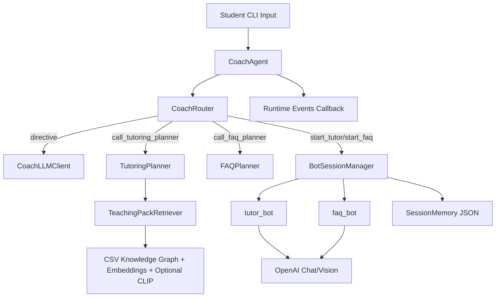
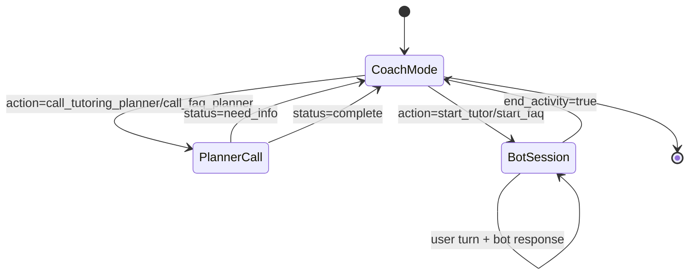

# System Design Document

## 1. Overview

This package implements a local, CLI-first multi-agent tutoring runtime for math learning support. It combines:

- a **Coach orchestrator** that routes intent and controls session transitions,
- a **Tutoring planner + retriever** pipeline that selects learning objectives (LOs),
- specialized **Tutor** and **FAQ** LLM bots that run focused sessions,
- lightweight **session memory** for continuity and progress tracking.

The core user problem it solves is: *“Help a student quickly get guided tutoring or course-policy answers in one conversational surface, while preserving continuity across sessions.”*

Primary users inferred from code:
- students asking conceptual/practice questions,
- students asking FAQ/syllabus/logistics questions,
- demo operators running local CLI sessions.

Why multi-agent here (implementation-grounded):
- The code separates orchestration (`CoachAgent` + `CoachRouter`) from task execution (`tutor_bot`, `faq_bot`) and planning (`TutoringPlanner`, `FAQPlanner`).
- This enables distinct prompts, state boundaries, and handoff contexts per role instead of one monolithic prompt.

## 2. Goals and Non-Goals

### Goals

- **Unified assistant experience** with internal role handoffs hidden from students.
- **Deterministic session structure** for tutoring:
  - one `current_plan` anchored by a primary LO plus optional supports,
  - one `future_plan` LO suggestion.
- **Adaptive tutoring** via prior mastery (`student_profile["lo_mastery"]`).
- **Hybrid retrieval** (dense + BM25, optional CLIP, optional LLM rerank).
- **Session continuity** with recent-session summaries and return greetings.
- **Operational safety** via retries, JSON coercion, and fallback responses.

### Non-Goals (explicit or strongly implied)

- Not a production multi-tenant service in this folder (no active API server module here).
- Not a full LMS integration (no gradebook/sis connectors).
- Not guaranteed factual coverage beyond local demo corpus and hardcoded FAQ scripts.
- Not a full policy/safety moderation framework beyond prompt-level constraints.

## 3. High-Level Architecture

### Component View

### Execution Model

- Single-process, synchronous turn handling.
- Controller loop in `CoachRouter.handle_turn()` may run up to 5 directive iterations per user turn.
- During an active bot session, turns bypass coach routing and go directly to tutor/FAQ bot execution.

## 4. Repository / Codebase Structure

Primary runtime directory: `src/workflow_demo`

| File | Responsibility |
|---|---|
| `run_demo.py` | CLI entrypoint + REPL + image token detection |
| `runtime_factory.py` | Shared runtime wiring (`build_coach_runtime`) |
| `coach_agent.py` | Top-level orchestrator state + delegation |
| `coach_router.py` | Policy loop, intent preclassification, planner/session dispatch |
| `coach_llm_client.py` | Coach LLM call wrapper, retries, directive parsing |
| `planner.py` | Tutoring plan generation + FAQ topic planning |
| `retriever.py` | Hybrid retrieval pipeline + caches|
| `tutor.py` | Tutor and FAQ bot prompts + JSON contract + fallbacks |
| `bot_sessions.py` | Session lifecycle, handoff, persistence, mastery updates |
| `session_memory.py` | Bounded session store + JSON persistence |
| `image_preprocessor.py` | Vision preprocessing for image-to-query conversion |
| `clip_embeddings.py` | CLIP text/image embedding backend |
| `data_loader.py` | CSV loading and graph lookup maps |
| `models.py` | Shared dataclasses (`Retrieval*`, legacy `SessionPlan`/`PlanStep`) |
| `runtime_events.py` | Structured runtime event primitives |
| `demo_profiles.py` | Demo profiles of students |
| `json_utils.py` | Robust JSON coercion from LLM responses |

Related validation suite: `tests/workflow_demo`

## 5. Core System Components

### 5.1 `CoachAgent` (`coach_agent.py`)

- **Purpose**: Runtime orchestrator that owns shared state and delegates work.
- **Responsibilities**:
  - initialize retriever, memory, planners, LLM wrappers,
  - maintain conversation state and transient image/session fields,
  - route turns to coach mode or active bot mode.
- **Inputs**: student text/image turns.
- **Outputs**: assistant message string.
- **Dependencies**: `CoachRouter`, `BotSessionManager`, `TutoringPlanner`, `FAQPlanner`, `SessionMemory`.

### 5.2 `CoachRouter` (`coach_router.py`)

- **Purpose**: Policy and control loop for coach-mode turns.
- **Responsibilities**:
  - preclassify easy intents (FAQ keywords, session-history questions),
  - call coach LLM for directives,
  - run planners and start sessions,
  - enforce syllabus escalation and conflict-based replanning.
- **Notable behavior**:
  - max 5 iterations per turn (`_MAX_LOOP_ITERATIONS`),
  - fast-track when student answers topic clarification with a short non-question phrase.

### 5.3 `CoachLLMClient` (`coach_llm_client.py`)

- **Purpose**: Single coach-brain API boundary.
- **Responsibilities**:
  - send structured payload to LLM with `COACH_SYSTEM_PROMPT`,
  - parse JSON directives,
  - retry transient API failures with exponential backoff.

### 5.4 Planners (`planner.py`)

#### `TutoringPlanner`
- Retrieves candidates from retriever (`retrieve_candidates`).
- Creates simplified plan shape:
  - `subject`, `mode`, `current_plan`, `future_plan`, `book`, `unit`, `chapter`.
- Optional LLM planning behind env flag `WORKFLOW_DEMO_ENABLE_PLANNER_LLM`; deterministic heuristic fallback otherwise.

#### `FAQPlanner`
- Maps to one hardcoded topic from `FAQ_TOPICS`.
- Optional LLM disambiguation, fallback to deterministic topic checks.

### 5.5 `TeachingPackRetriever` (`retriever.py`)

- **Purpose**: Candidate and context retrieval from CSV-derived KG data.
- **Stages**:
  1. Dense embeddings (OpenAI) + BM25,
  2. reciprocal-rank fusion,
  3. optional rerank with chat model,
  4. optional CLIP image retrieval and LO merge.
- **Data sources**: `demo/lo_index.csv`, `content_items.csv`, `edges_prereqs.csv`, `edges_content.csv`, optional `image_corpus/image_metadata.csv`.
- **Caching**: text/image embedding caches in `demo/.embedding_cache`.

### 5.6 Bot Runtime (`bot_sessions.py` + `tutor.py`)

- **`BotSessionManager`** handles start/invoke/end lifecycle and persistence.
- **`tutor_bot`** and **`faq_bot`** run JSON-constrained LLM responses with strict schema normalization and fallback paths.
- Tutor supports multimodal input using native vision content formatting (`_image_to_content`).

### 5.7 `SessionMemory` (`session_memory.py`)

- Maintains max-N session entries (default 5) and `student_profile`.
- Persists to JSON schema:
  - `sessions`: list of session entries,
  - `student_profile`: includes `lo_mastery`.

### 5.8 Image Preprocessing (`image_preprocessor.py`)

- Converts uploaded image + optional text into retrieval query signal.
- Uses GPT-4o vision with constrained JSON response to output:
  - `query`, `detected_type`, `confidence`, `latex_content`, `key_features`, `likely_topic`.

## 6. Agent Architecture

This is a **practical multi-agent pattern** rather than a separate-agent process model.

### Agents / Roles

| Role | Implemented As | Responsibility |
|---|---|---|
| Coach | `CoachAgent` + `CoachRouter` + `CoachLLMClient` | Intent routing, planner orchestration, handoffs |
| Tutoring Planner | `TutoringPlanner` | Plan LO sequence from retrieval candidates |
| FAQ Planner | `FAQPlanner` | FAQ topic disambiguation and script selection |
| Tutor Bot | `tutor_bot` | In-session teaching interactions |
| FAQ Bot | `faq_bot` | In-session FAQ/syllabus interactions |

### Handoff and Sequencing

- Sequential orchestration; no true parallel agent execution.
- Coach LLM outputs directive (`action` + `tool_params`).
- Router calls planners if needed, then starts bot sessions.
- Bot sessions produce messages until `end_activity=true`, then return control to coach.

### Memory/State Visibility by Role

- Coach sees global conversation snippets + session history + planner state.
- Tutor/FAQ bot sees `handoff_context` (session params, summary, recent sessions, student state, image).
- Session memory persists only at session completion.

### Tool Access

- Coach tools: planner calls, session start, proficiency report.
- Tutor/FAQ tool surface is implicit through prompt and payload; no external function-calling API in bot code.

## 7. End-to-End Workflow

### Main Runtime Flow (numbered)

1. `run_demo.py` receives user input from CLI.
2. Optional image token detection (`detect_image_input`); multimodal turns call `process_multimodal_turn`.
3. `CoachAgent.process_turn` routes:
   - active bot session -> `BotSessionManager.handle_turn`,
   - else -> `CoachRouter.handle_turn`.
4. Router preclassifies special intents (FAQ keyword, session history, syllabus escalation tracking).
5. Router requests coach directive from `CoachLLMClient.get_directive`.
6. Based on `action`, router:
   - calls tutoring planner, or
   - calls FAQ planner, or
   - starts tutor/FAQ session, or
   - returns normal coach message, or
   - shows proficiency report.
7. Session start builds handoff context via `create_handoff_context`.
8. Tutor/FAQ bot generates JSON response from prompt + payload.
9. On `end_activity=true`, bot session manager:
   - stores session summary in memory,
   - updates LO mastery for tutor sessions,
   - handles switch requests by synthetic coach turns,
   - returns continuity greeting.

### Example Flow A: Concept tutoring question

- Student: “Help me with derivatives.”
- Coach action loop: `call_tutoring_planner` -> `start_tutor`.
- Planner retrieves candidate LOs and builds plan.
- Tutor opens session immediately (no explicit plan confirmation).

### Example Flow B: Syllabus/admin question

- Student: “What topics are in this course?”
- Preclassification tags syllabus intent.
- Router either starts FAQ route directly or forces FAQ after repeated clarifications.
- FAQ bot answers using script and follow-up question.

### Example Flow C: Session continuation question

- Student: “What did we cover last time?”
- Regex interception in router avoids LLM call.
- Response built from `SessionMemory.last_tutoring_session()`.

## 8. Data Flow and State Management

### State Types

- **Conversation state**: `CoachAgent.conversation_history` (last 20 messages).
- **Routing state**: `collected_params`, `planner_result`, syllabus escalation flags.
- **Bot-session state**: active flag/type/handoff context + bot conversation history.
- **Student state**: `student_profile["lo_mastery"]`.
- **Persistence state**: session entries + profile in JSON file (`session_memory.json` by default from `run_demo.py`).

### Persistence Characteristics

- Session memory persists across runs if path provided.
- Retrieval embeddings cache persists under `demo/.embedding_cache`.
- No transactional DB; filesystem JSON + NumPy files only.

## 9. Knowledge / Retrieval Architecture

### Explicitly Implemented

- CSV-backed knowledge graph loading (`data_loader.py`).
- LO and content corpus construction.
- OpenAI embedding generation for text corpus.
- BM25 keyword indexing for lexical recall.
- Reciprocal Rank Fusion (`_hybrid_fusion`).
- Optional LLM reranking (`_rerank_hits`).
- Optional CLIP image index for visual retrieval.
- Candidate merge of text/image retrieval outputs.

### Injected into Planning / Teaching

- `TutoringPlanner` consumes merged LO candidates and proficiency map.
- Plan entries include `how_to_teach` and `why_to_teach`.
- Tutor bot receives plan within `handoff_context.session_params`.

### Limitations

- `how_to_teach` / `why_to_teach` currently generated heuristically in retriever (`_get_how_to_teach`, `_get_why_to_teach`), not read from authoritative KG attributes.
- Multiple legacy retrieval methods remain (`retrieve_plan` returning dataclasses) while active path uses `retrieve_candidates`.

## 10. Interfaces and APIs

### External Runtime Interface

- CLI entrypoint: `python -m src.workflow_demo.run_demo`
- User commands in REPL: normal text, image path/url inline, `quit`/`exit`.

### Internal Interfaces

- `CoachAgent.process_turn(user_input: str) -> str`
- `CoachAgent.process_multimodal_turn(text: str, image: str) -> str`
- `TutoringPlanner.create_plan(payload: dict) -> {"status","plan","message"}`
- `FAQPlanner.create_plan(payload: dict) -> {"status","plan","message"}`
- `TeachingPackRetriever.retrieve_candidates(...) -> RetrievalResult`
- `BotSessionManager.begin(...) -> str`, `handle_turn(...) -> str`

### Models / Schemas

- Dataclasses: `RetrievalCandidate`, `RetrievalResult`, and legacy `PlanStep`, `TeachingPack`, `SessionPlan`.
- Bot output schemas enforced in `tutor.py` normalizers.

### Inference / Gap

- README references FastAPI bridge (`web_api.py`) but this file is absent in `src/workflow_demo` at inspection time.

## 11. Prompting and LLM Design

### Coach Prompt (`COACH_SYSTEM_PROMPT`)

- Defines allowable actions and routing policy.
- Contains intent heuristics for tutoring/faq/proficiency/syllabus.
- Requires strict JSON directive output.

### Tutoring Prompt (`TUTOR_SYSTEM_PROMPT`)

- Enforces “start teaching immediately”.
- Enforces plan adherence (`current_plan`, `future_plan`, mode).
- Controls out-of-plan behavior and mode/topic switch handling via structured flags.

### FAQ Prompt (`FAQ_SYSTEM_PROMPT`)

- Restricts answers to provided script.
- Defines completion cues that must end activity.

### Structured Output Pattern

- `response_format={"type":"json_object"}` used for tutor/faq requests.
- Shared JSON coercion and normalization harden against malformed output.
- One retry with `_JSON_ONLY_RETRY_PROMPT` before fallback.

## 12. Error Handling, Guardrails, and Safety

### Implemented Guardrails

- Coach API retries on rate limit/connection/timeout/5xx.
- Max routing loop iteration cap prevents infinite loops.
- Bot invalid-JSON fallback responses keep sessions alive.
- Session-state guard in bot invocation returns greeting if inconsistent.
- Syllabus escalation fallback prevents endless clarification loops.

### Safety Scope

- Primarily prompt-based pedagogical and behavior constraints.
- No explicit content moderation or abuse handling in this module set.

## 13. Design Tradeoffs

- **Modularity vs simplicity**: Clean role separation, but many cross-file dependencies and duplicated legacy paths.
- **Multi-agent vs single-agent**: Better control and testability of role behavior; higher orchestration complexity.
- **Determinism vs capability**: Heuristic planning is robust and testable; LLM-enabled planning is richer but gated by env and external reliability.
- **Local persistence vs infra complexity**: JSON/NumPy files keep setup simple; limits scalability and concurrency guarantees.
- **Prompt governance vs code policies**: Fast to iterate, but brittle when prompts drift from implementation assumptions.

## 14. Risks / Gaps / Technical Debt

1. **Legacy/current flow overlap**
   - `retriever.py` still carries legacy `retrieve_plan` + `SessionPlan` path while active orchestration uses candidate-based planner flow.
2. **Potentially stale docs/tests**
   - README references absent web API modules.
   - `tests/workflow_demo/test_image_preprocessor.py` targets fields not present in current `ImageQueryResult` implementation.
3. **Prompt-coupled behavior**
   - Critical routing/ending semantics rely on model compliance with strict JSON and nuanced instructions.
4. **Observability is lightweight**
   - Runtime events exist but no durable tracing or metrics pipeline.
5. **Scalability limits**
   - In-memory conversation/session handling, local file persistence, synchronous calls.
6. **Data quality coupling**
   - Teaching guidance fields are generated heuristics, not guaranteed pedagogical metadata quality.

## 15. Recommendations

### Short-Term (high ROI)

- Remove or isolate legacy plan APIs into explicit compatibility layer.
- Reconcile README with actual module set; either add missing web bridge or remove stale references.
- Align/repair stale tests (especially image preprocessor contract tests).
- Add structured logging IDs linking coach directives, planner outputs, and bot sessions per turn.

### Medium-Term

- Promote planner and bot JSON schemas to typed Pydantic models for stronger validation.
- Persist runtime events for replay/debugging.
- Add contract tests for prompt-output shape under representative edge cases.

### Product Robustness

- Move FAQ scripts to versioned content configuration instead of code constants.
- Introduce explicit confidence/grounding score propagation from retrieval into planning and tutor messaging.
- Add user-facing fallback messaging for low-retrieval-confidence cases.

## 16. Appendix

### A. Key Runtime Symbols

- `build_coach_runtime()` in `runtime_factory.py`
- `CoachAgent.process_turn()` in `coach_agent.py`
- `CoachRouter.handle_turn()` in `coach_router.py`
- `TutoringPlanner.create_plan()` in `planner.py`
- `TeachingPackRetriever.retrieve_candidates()` in `retriever.py`
- `BotSessionManager.begin()` / `_finalize_bot_session()` in `bot_sessions.py`

### B. State Transition Sketch

### C. Explicit vs Inferred Notes

- **Explicitly implemented**: CLI flow, multi-role orchestration, retrieval/planning/bot handoff, memory persistence, image-aware tutoring path.
- **Inferred from architecture/tests**: intended continuity-centric UX and future web-bridge integration.
- **Not implemented in inspected folder**: active API/web endpoint modules referenced by top-level README.
